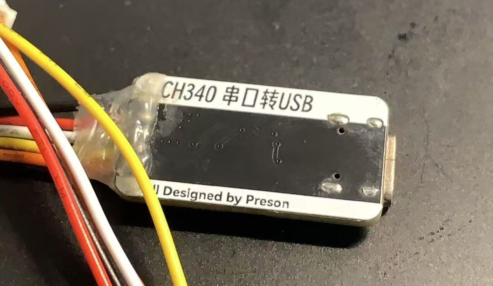
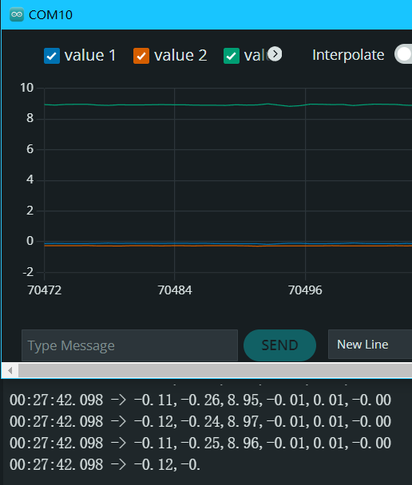

- 上传代码 & 驱动 MPU6050

用 **MPU 6050** 和 **ESP8266-01S** 制作一个无线加速度传感器

<!--truncate-->
# 项目内容
## 概述
这个项目，我想使用 MPU6050 做传感器，ESP8266 做数据读取和网页服务端，网页显示动态的加速度数据和三轴加速度变化曲线图。

## 应用场景
设计的应用场景是**高中物理教学**，在学习力学（牛顿三定律）和后面的圆周运动中都多多少少需要测量加速度，虽然物理老师会用比较原始的方式测量到加速度让学生懂得原理，但在此之后原理不再是最重要的部分，而快速、准确、直观地获得数据变得更加重要。

## 优点
**无线**：不用连接数据线，进行实验时，不用担心数据线阻力或者缠绕的困扰。  
**测显分离**：使用手机加速度测量软件时通常需要先测量再看数据，而这个设备可以边测边看到数据变化。  

## 缺点
目标应用场景过于当一，作为产品的话不太会有销量。

# 制作
首先我要搞定的是 ESP8266 上传程序的问题，之前使用 Arduino IDE 就没成功上传过 ESP8266 的程序，都用的 ESP32 替代的……
## 程序烧录
参考了[ESP8266 下载/烧录IDE编译的程序](https://blog.csdn.net/baidu_25117757/article/details/109639337?sharetype=blogdetail&shareId=109639337&sharerefer=APP&sharesource=m0_52526597&sharefrom=link)和 「Grok 2」的回答，使用了之前给我爸做的项目做的一个 CH340 「USB-C」转「串口」的板子上传程序


需要注意的是接线和Reset线的连接

```
ESP <==> 串口  
3V3 <==> 3V3  
GND <==> GND  
RX  <==> TX  
TX  <==> RX  
IO0 <==> GND  
```

RESET 要注意先拉低之后重置完就要拉高，把跳线裸露容易导致上传失败（可能是内部没有上拉？）。  
然后我花了差不多一个小时成功传上去了 「Blink」。  


## 驱动 MPU6050
使用了 [Adafruit MPU6050](https://github.com/adafruit/Adafruit_MPU6050) 库，先用了库里的「Example」由于 ESP8266-01S 所保留的 GPIO 没有包含硬件 IIC 主线，所以需要改默认引脚：
```
#define SDA_PIN 0 // IO0
#define SCL_PIN 2 // IO2 

Wire.begin(SDA_PIN, SCL_PIN); //使用模拟IIC
```
然后改了下「Serial」的发送内容和「Delay」传了上去：
