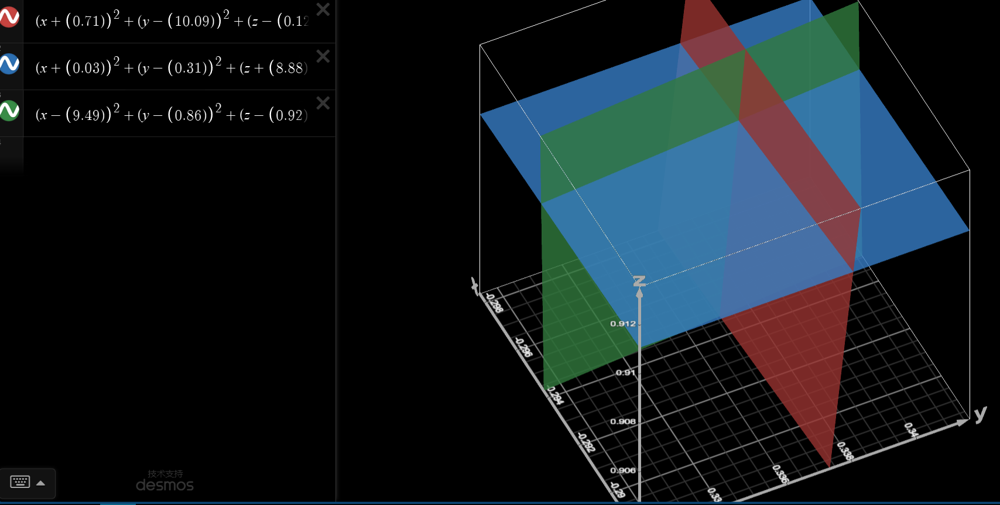

- 适配 MPU6050

用 **MPU 6050** 和 **ESP8266-01S** 制作一个无线加速度传感器

<!--truncate-->
# MPU6050 适配
MPU6050 已经在[上一章](wireless-accelerometer-1)完成驱动，但可以看到，它的静态读数为(-0.11,-0.25,8.96)，并不是 9.8 的重力加速度，所以现在，我需要对这个数据进行处理，主要是零漂和抖动。
## 零漂
零漂就是在静止状态下的漂移，校准零漂类似于「调零」。
### 方法验证
我想到的解决办法是解方程组:
$$
\left\{\begin{matrix}
(x_1+o_x)^2+(y_1+o_y)^2+(z_1+o_z)^2=9.8^2\\ 
(x_2+o_x)^2+(y_2+o_y)^2+(z_2+o_z)^2=9.8^2\\ 
(x_3+o_x)^2+(y_3+o_y)^2+(z_3+o_z)^2=9.8^2
\end{matrix}\right.
$$
$x,y,z$ 作为读取的数据，$o_x,o_y,o_z$ 是三轴的偏移量。  
实际上解这个三元二次方程是很难的，我先带了三个 $x,y,z$
$$
(0.03,-0.31,8.88)\\
(-9.49,-0.86,-0.92)\\
(0.71,-10.09,-0.12)\\
$$
得到方程组：
$$
\left\{\begin{matrix}
(0.03+o_x)^2+(-0.31+o_y)^2+(8.88+o_z)^2=9.8^2\\ 
(-9.49+o_x)^2+(-0.86+o_y)^2+(-0.92+o_z)^2=9.8^2\\ 
(0.71+o_x)^2+(-10.09+o_y)^2+(-0.12+o_z)^2=9.8^2
\end{matrix}\right.
$$
但是我把这个输入 [Microsoft MathSolver](https://mathsolver.microsoft.com/zh) 它说表达式有问题，其实后来我知道这是个函数不能解出精确值，只能逼近估算。所以我找了个[三维函数绘制器](https://www.desmos.com/3d?lang=zh-CN)

放大放大再放大，读出交点为 $(-0.3,0.34,0.91)$ 即为漂移量 (Offset)。
回带数据：
`(-3.51,-5.67,6.38)==>(-3.81,-5.33,7.29)==>9.80148`  
`(2.01,5.07,7.12)==>(1.71,5.41,8.03)==>9.8322`   
`(-0.16,8.58,3.33)==>(-0.46,8.92,4.24)==>9.887`  
接近重力加速度 9.8 验证方法可行。
### 方程解算
#### ~~牛顿迭代~~
这个三元一次方程求解时我有想到 GPS 定位也是类似的解算方法，于是在网上搜索了一番，发现可以用「牛顿迭代」，但是太难，没看懂，弃。
#### ~~枚举法~~
退而求其次使用枚举法，Python代码：
```Python
# (-0.3,0.34,0.91)

#定义原数据
d1=[0.03,-0.31,8.88]
d2=[-9.49,-0.86,-0.92]
d3=[0.71,-10.09,-0.12]

#计算精确度
resut = [[[0 for _ in range(20)] for _ in range(20)] for _ in range(20)]
for i in range(-10,10):
    for j in range(-10,10):
        for k in range(-10,10):
            resut[i+10][j+10][k+10] = abs((0.1*i +d1[0])**2+(0.1*j+d1[1])**2+(0.1*k+d1[2])-9.8**2)+abs((0.1*i +d2[0])**2+(0.1*j+d2[1])**2+(0.1*k+d2[2])-9.8**2)+abs((0.1*i +d3[0])**2+(0.1*j+d3[1])**2+(0.1*k+d3[2])-9.8**2)

#找到最接近的值
minn=100000.0000
for i in range(-10,10):
    for j in range(-10,10):
        for k in range(-10,10):
            if(resut[i+10][j+10][k+10]<minn):
                minn=resut[i+10][j+10][k+10]
                x=i
                y=j
                z=k
print(minn,x,y,z)
```
运行结果
```
86.9415 -3 3 8
```
`(-0.3,0.3,0.8)`接近了，还不够，但现在运行的精度0.1已经运行了 $20^3$ 次带有九个乘方的代码，还要给 $20^3$ 个 Float 比大小。使用至少 $21^3*2=18522bit$ SRAM，再提高精度会使内存占用立方上涨，所以弃用此方法。
#### 「八分法」
效仿二分法，将给定一个立方体，示例为 $(-1,-1,-1) to (1,1,1)$ 作为逼近区间
##### ~~27点法~~
将区间切分为8个小矩形，取小矩形的共27个顶点：
$$
(-1,-1,-1),(-1,-1,0),(-1,-1,1),\\
(-1,0,-1),(-1,0,0),(-1,0,1)\\
······
$$
任然带之前的数据，得到（整数化后，方便观察）：
$$
[[[127, 128, 129],\\ [105, 106, 107],\\ [113, 112, 111]],\\ ---\\ [[117, 116, 115],\\ [100, 99, 98],\\ [110, 107, 104]],\\ ---\\ [[137, 136, 135],\\ [120, 119, 118],\\ 
[124, 121, 118]]]
$$
再将每个小矩形对应的八个数相加，作为它的误差总和，然后选取最小误差总和的数作为下一次八分区间，Python程序：
```Python
# (−0.3,0.34,0.91)

#定义原数据
# (−0.3,0.34,0.91)

#定义原数据
d1=[0.03,-0.31,8.88]
d2=[-9.49,-0.86,-0.92]
d3=[0.71,-10.09,-0.12]

c=0.0001#精确度
ba=[[-2,-2,-2],[2,2,2]]#给定区间(小到大)
a=ba

result = [[[0 for _ in range(3)] for _ in range(3)] for _ in range(3)]
block = [[[0 for _ in range(2)] for _ in range(2)] for _ in range(2)]

while (a[1][0]-a[0][0] >=c ):
    dd=0
    for i in [a[0][0],(a[0][0]+a[1][0])/2,a[1][0]]:
        for j in [a[0][1],(a[0][1]+a[1][1])/2,a[1][1]]:
            for k in [a[0][2],(a[0][2]+a[1][2])/2,a[1][2]]:
                result[int(dd/9)][int(dd/3)%3][dd%3] = abs((i+d1[0])**2+(j+d1[1])**2+(k+d1[2])**2-96.04)**(1/2)+abs((i+d2[0])**2+(j+d2[1])**2+(k+d2[2])**2-96.04)**(1/2)+abs((i+d3[0])**2+(j+d3[1])**2+(k+d3[2])**2-96.04)**(1/2)
                #一次加权误差值
                
                dd=dd+1
    #计算小区间的误差
    for i in range(2):
        for j in range(2):
            for k in range(2):
                block[i][j][k] = result[i][j][k]+result[i][j][k+1]+result[i][j+1][k]+result[i][j+1][k+1]+result[i+1][j][k]+result[i+1][j][k+1]+result[i+1][j+1][k]+result[i+1][j+1][k+1]
    
    #找到最小的小区间
    minn=100000.0
    x,y,z=0,0,0
    for i in range(2):
        for j in range(2):
            for k in range(2):
                if(block[i][j][k]<minn):
                    minn=block[i][j][k]
                    x=i
                    y=j
                    z=k

    #定义下一个八分区间
    a=[[a[0][0] if x==0 else (a[0][0]+a[1][0])/2,a[0][1] if y==0 else (a[0][1]+a[1][1])/2,a[0][2] if z==0 else (a[0][2]+a[1][2])/2],[(a[0][0]+a[1][0])/2 if x==0 else a[1][0],(a[0][1]+a[1][1])/2 if y==0 else a[1][1],(a[0][2]+a[1][2])/2 if z==0 else a[1][2]]]

#用中间数赋值结果
ox,oy,oz = (a[1][0]+a[0][0])/2,(a[1][1]+a[0][1])/2,(a[1][2]+a[0][2])/2

print(ox,oy,oz)
```

结果`(-0.2957,0.3312,0.9163)`显然逼近正确，
再带
$$
(0.70,-4.33,8.05)
(-8.71,-1.24,-4.89)
(1.24,-9.20,-5.13)
$$
三个非特殊姿态，再来进行解算，得`(-0.21,0.41,0.91)`，还算可以。
可以作为一种备选方案，但把初始区间改大之后到 $(-4,-4,-4) to (4,4,4)$ 就会出现`(0.000152587890625,0.316497802734375,-3.0517578125e-05)`，在八分时到了其他地方。
##### 8点法
把区间分为8个小矩形，取矩形中点算值，原理类似[27点法](#27点法)，而且测试精度更高……但我先想到27点法，没想到多带点反倒会干扰对错误数值的惩罚，8点法Python程序：
```Python
# (−0.3,0.34,0.91)

#定义原数据
# d1=[0.70,-4.33,8.05]
# d2=[-8.71,-1.24,-4.89]
# d3=[1.24,-9.20,-5.13]
# d1=[0.64, -0.30, 8.94]
# d2=[-9.33,-0.84,0.78]
# d3=[0.23,-8.94,3.71]
d1=[0.03,-0.31,8.88]
d2=[-9.49,-0.86,-0.92]
d3=[0.71,-10.09,-0.12]

c=0.0001#精确度
ba=[[-3,-3,-3],[3,3,3]]#给定区间(小到大)
a=ba

result = [[[0 for _ in range(2)] for _ in range(2)] for _ in range(2)]

while (a[1][0]-a[0][0] >=c ):
    dd=0
    ax,ay,az=a[1][0]-a[0][0],a[1][1]-a[0][1],a[1][2]-a[0][2],
    for i in [a[0][0]+ax/4,a[0][0]+ax/4*3]:
        for j in [a[0][1]+ay/4,a[0][1]+ay/4*3]:
            for k in [a[0][2]+az/4,a[0][2]+az/4*3]:
                result[int(dd/4)][int(dd/2)%2][dd%2] = abs((i+d1[0])**2+(j+d1[1])**2+(k+d1[2])**2-96.04)**(1/2)+abs((i+d2[0])**2+(j+d2[1])**2+(k+d2[2])**2-96.04)**(1/2)+abs((i+d3[0])**2+(j+d3[1])**2+(k+d3[2])**2-96.04)**(1/2)
                #一次加权误差值
                dd=dd+1
    
    #找到最小的小区间
    minn=100000.0
    x,y,z=0,0,0
    for i in range(2):
        for j in range(2):
            for k in range(2):
                if(result[i][j][k]<minn):
                    minn=result[i][j][k]
                    x=i
                    y=j
                    z=k

    #定义下一个八分区间
    a=[[a[0][0] if x==0 else (a[0][0]+a[1][0])/2,a[0][1] if y==0 else (a[0][1]+a[1][1])/2,a[0][2] if z==0 else (a[0][2]+a[1][2])/2],[(a[0][0]+a[1][0])/2 if x==0 else a[1][0],(a[0][1]+a[1][1])/2 if y==0 else a[1][1],(a[0][2]+a[1][2])/2 if z==0 else a[1][2]]]

#用中间数赋值结果
ox,oy,oz = (a[1][0]+a[0][0])/2,(a[1][1]+a[0][1])/2,(a[1][2]+a[0][2])/2

print(ox,oy,oz)
```
---
至此，方程的解算算是完成了，现在需要把 Python 程序打包成 C语言 供 Arduino IDE 里使用。
~~找AI帮了下忙~~ 废物AI，花了我几十分钟改正它的程序，不如自己写：
```C
#include <math.h>

// 定义vector3结构
typedef struct {
    float x;
    float y;
    float z;
} vector3;

float abss(float x){return (x<0)?(-x):x;}
float result[3][3][3]={0};
// 使用八分法求解偏移量的函数

vector3 offset_solve(vector3 d1, vector3 d2, vector3 d3, float c, vector3 s, vector3 e) {
  while (e.x-s.x >=c)
  {
    float ax=e.x-s.x;float ay=e.y-s.y;float az=e.z-s.z;
    float ix,iy,iz;
    for (int i=0;i<2;i++){
      for(int j=0;j<2;j++){
        for(int k=0;k<2;k++){
          if(i==0)ix=s.x+ax/4;else ix=s.x+ax/4*3;
          if(j==0)iy=s.y+ay/4;else iy=s.y+ay/4*3;
          if(k==0)iz=s.z+az/4;else iz=s.z+az/4*3;
          float e1=sqrt(abss((ix+d1.x)*(ix+d1.x)+(iy+d1.y)*(iy+d1.y)+(iz+d1.z)*(iz+d1.z)-96.04));
          float e2=sqrt(abss((ix+d2.x)*(ix+d2.x)+(iy+d2.y)*(iy+d2.y)+(iz+d2.z)*(iz+d2.z)-96.04));
          float e3=sqrt(abss((ix+d3.x)*(ix+d3.x)+(iy+d3.y)*(iy+d3.y)+(iz+d3.z)*(iz+d3.z)-96.04));
          result[i][j][k]=e1+e2+e3;
    }}}
    float minn=1000000.0;
    int x,y,z;
    for (int i=0;i<2;i++){
      for(int j=0;j<2;j++){
        for(int k=0;k<2;k++){
          if(result[i][j][k]<minn){
            minn=result[i][j][k];
            x=i;y=j;z=k;
          }
    }}}
    s.x=(x==0)?s.x:((s.x+e.x)/2);
    s.y=(y==0)?s.y:((s.y+e.y)/2);
    s.z=(z==0)?s.z:((s.z+e.z)/2);

    e.x=(x==0)?((s.x+e.x)/2):e.x;
    e.y=(y==0)?((s.y+e.y)/2):e.y;
    e.z=(z==0)?((s.z+e.z)/2):e.z;
  }

  vector3 out = {(s.x+e.x)/2,(s.y+e.y)/2,(s.z+e.z)/2};
  return out;
}

void setup(){
  Serial.begin(115200);
}
void loop(){
  vector3 d1={0.64, -0.30, 8.94};
  vector3 d2={-9.33,-0.84,0.78};
  vector3 d3={0.23,-8.94,3.71};
  float c = 0.001;
  vector3 s = {-1,-1,-1};
  vector3 e = {1,1,1};
  vector3 out = offset_solve(d1, d2, d3, c, s, e);
  Serial.print(out.x);
  Serial.print(",");
  Serial.print(out.y);
  Serial.print(",");
  Serial.println(out.z);
  delay(500);
}
```
成功打印出正确偏移量`00:35:39.090 -> -0.31,0.29,0.90` ，零漂也算是不太完美的解决了。
<!-- [下一章](wireless-accelerometer-3) -->