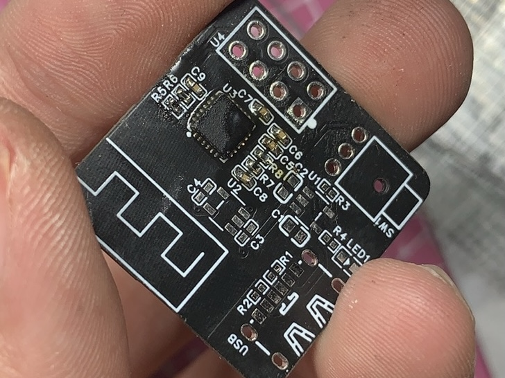

**「学习电子技术其实是一个不断放弃的过程」**  
我本来板子已经打好了，以为焊好他就是一块很好的测试开发板了，但是……我错了。
<!--truncate-->
## First Fall 虚焊？
我用热风枪焊好了板子，把 ESP8266-01S 垛在了板子上焊好了，但是，跑不动，MPU6050 的 IIC 地址都搜不到。

（测试失败
## Second Fall 拆板
我认为可能是没焊好，有虚焊所以才导致 IIC 连不上，于是我把 ESP8266 拆了下来（八针真的一点不好拆，我一根根引脚拔出来的），检查了引脚，似乎没问题。

（放弃使用这块板子
## Third Fall 重焊
我认为可能是因为第一次用风抢把 MPU6050 吹坏了，于是用烙铁又焊了一遍，都懒得清焊油了。  

（测试失败
## Fouth Fall 线路问题？
**可能是因为我的 PCB 设计有问题吧？**  
——看看别人怎么设计的把。  
**我参考了下，别人的设计，好像 AD0 是悬空的？**  
把铜箔隔断试试（失败    
**别人 EP 引脚好像接地了耶**  
那接一下吧……怎么接？走后面打孔！

打断线了，飞下线吧。

（还是失败了
## 放弃
### 「学习电子技术其实是一个不断放弃的过程」  
### 「使用一个新的芯片就如同熟悉一个新男友」
（我没体验过，因为我没有过😔，Could you be? ）。 

---------   
我选择放弃使用 MPU6050，本来它也是过时了的产品。  
我曾经也放弃过一些东西，初学的时候用的是 Arduino UNO，但后来认为太大了，用了 Arduino Nano；认为性能不够，换了 MEGA2560。性能还是不够用，就上了 RP2040（我最喜欢的单片机了）。但暑假的时候有个项目需要用 EEPROM 存数据，RP2040 再加存储那价格就压不下来了，所以换用了 STM32C011F4P6 性能正好，有 EEPROM，价格也还不错。  
``Arduino UNO`` ``Arduino Nano`` ``Arduino MEGA 2560``就都被放弃了，现在，我放弃了那个陪我至少5年的 MPU6050 了。

### 「未来我还会放弃些什么呢」
这不是抒情😭
### 「我会找到它/他吗」
「？？？」