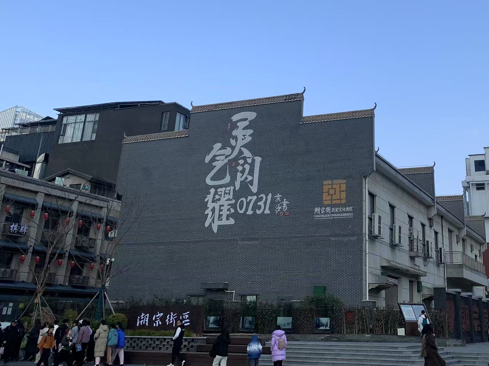
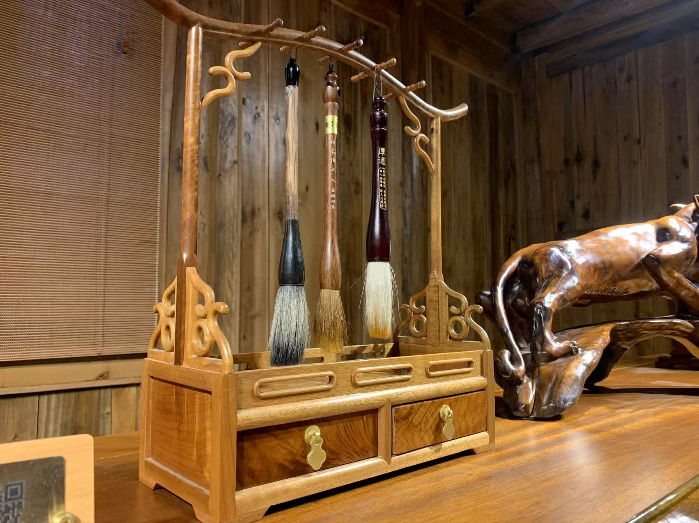
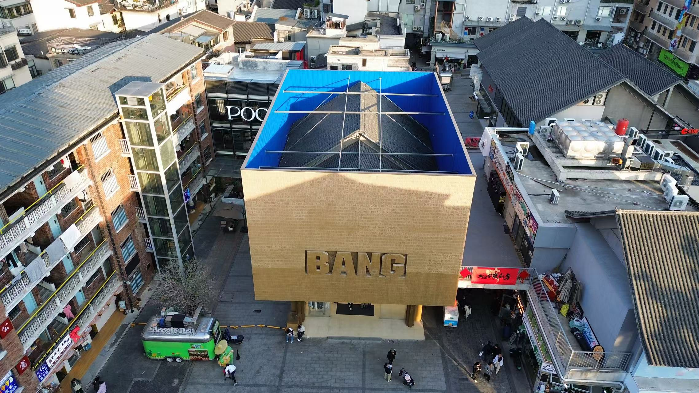
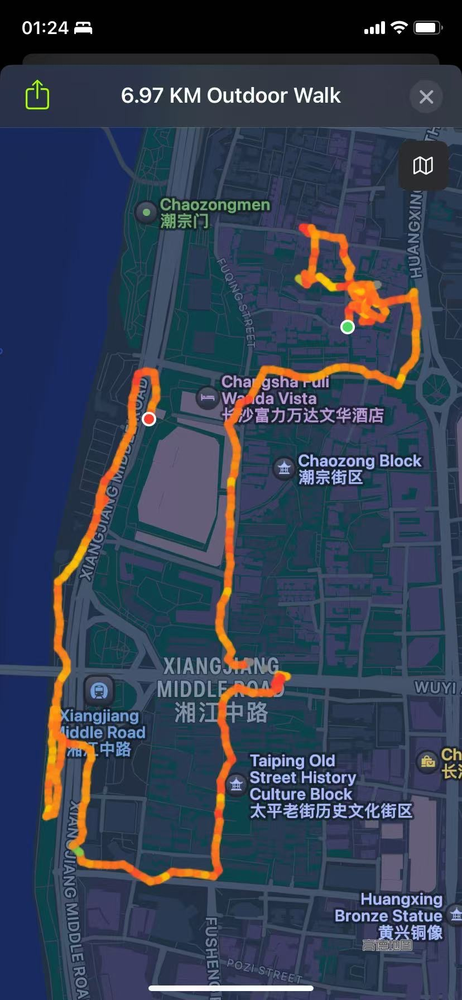
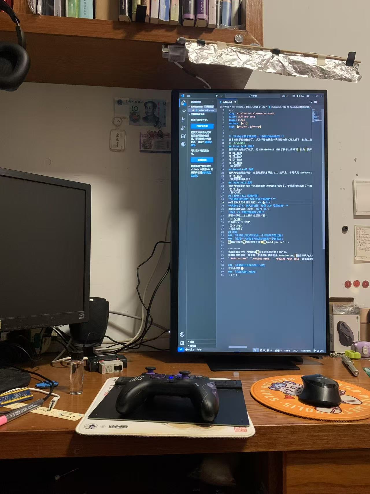

今天，天气不错，也是一般起床时间 11 点，昨天<!--熬夜到了 4:48 -->安排好了行程。  

<!--truncate-->

## Redamancy
Redamancy 说大概安排在 2:00 p.m. 到 9:00 p.m.，一共七个小时，我准备了三个行程：
1. 从文昌阁地铁站出来沿湘江走到万达广场附近吃晚餐，然后到湘江中路地铁站坐地铁回家。
2. 万家丽广场
3. 我家
最后选择了第一个方案。  
起床！阳光明媚（11点到），煮饭，吃中餐，准备出发！  
携带内容：
>DJI MINI 3  
充电宝  
冷火烟花+打火机

打好包，骑单车到了大塘地铁站，本以为打火机、烟花和充电宝会被拦下来检查下的……好吧，地铁安检根本就是……坐到了朝阳村六号地铁站等 Redamancy，中途还有个老奶奶要上厕所，要我帮她看东西，（作为外面套皮南雅，里面套皮长郡的学生，我当尽主人之责）我帮她看了一下，然后地铁刚好到了，她出来急匆匆把东西拿走了。  

---

然后我就和 Redamancy 一起坐到了文昌阁，往西走到了湘江风光带（风帆广场），在那里飞了下无人机，然后继续南下，去了潮宗街逛了半天。  

继续逛到了一个卖金丝楠木制品到店子，那个店子是木屋，用的金丝楠木起的，Redamancy 给我解释了很多关于金丝楠木的内容。  

然后在一个屋子的顶楼起飞拍到了……「自欺欺人」楼。  

---

出潮宗之后，继续南下，过了万达广场，到了太平老街……「明明不是外地人，为什么还要和他们人挤人」，终于挤出了太平街，我们又往湘江边走了，沿湘江往北走。中途，我拿出了我的冷火烟花，虽然天还没完全黑，但冷火烟花的亮度也已经足够照亮附近的地面了。  

「要吃晚餐了吧」  

种种排除后，我们选了万达广场的麦当劳，人均 ¥30。  

之后就一起走到了地铁站，坐地铁回家了，他往北，我往南。  

**「See u next time～」**

最终花费：
>地铁 7.2  
水 2  
瑞辛 9.9  
麦当劳 30  
SUM ¥49.1

## 《哪吒 2》
下地铁后，我直接去了电影院旁边的商城，我的家人们正在那里购物。之后就去了电影院一起看了 《哪吒 2》。  
**申小豹真的很可爱😍**（福瑞控审美）

可是……为什么他最后死透了呀？😭  
「杀我福瑞者，虽远必诛！」  
<!--真想抱住小豹猛草，然后再让小豹草死我-->

## Redmin A27U 显示器
用压岁钱买了个屏幕，¥1290拿下（大出血），看完电影回家拆包。  
4K 60FPS真的有点舒服，还可以开 HDR ，这个价格算是不错了，色域够，还有出产校准，太棒了，就是27in 有点大。

